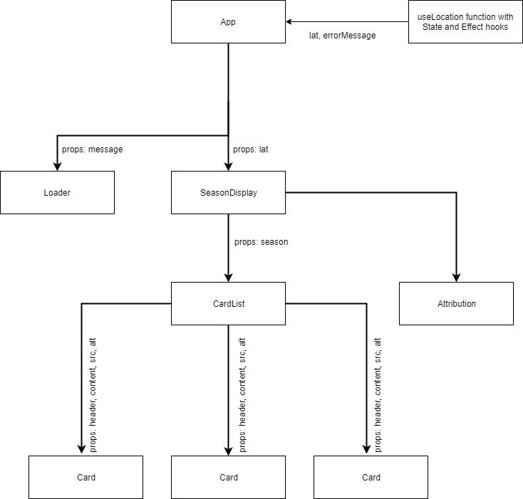

## Seasonal activities

Practicing rendering content conditionally and using hooks. This app shows different activities based on what season is at the moment.
The challenge was to get month and hemisphere (user's location - using Geolocation API), determine season and then suggest to the user some seasonal activities.

#### Install

    $ git clone https://github.com/orvalho/seasons-activities
    $ cd seasons-activities
    $ npm install

#### Start

    $ npm start

### Challenges

### App structure

### CardList & Cards

### Stack

-   React
-   React DOM
-   Semantic UI
